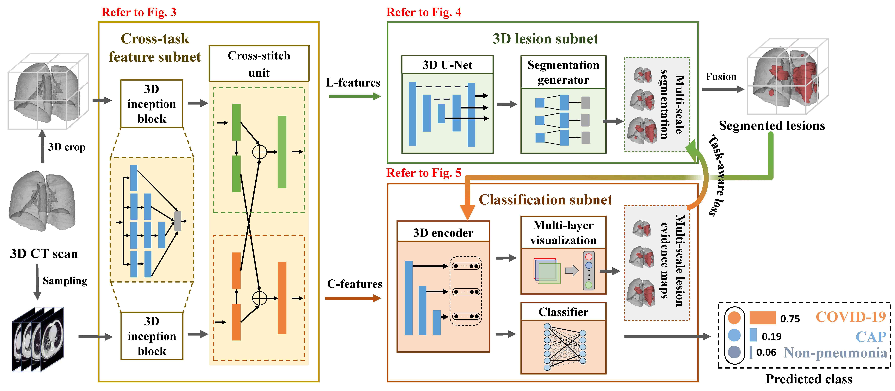

# Joint learning of 3D lesion segmentation and classification for explainable COVID-19 diagnosis
- This is the official repository of the paper "Joint learning of 3D lesion segmentation and
classification for explainable COVID-19 diagnosis
" from **IEEE TMI 2021**[[Paper Link]](http://www.buaamc2.net/pdf/TMI21COVID.pdf "Paper Link")



## 1. Environment
- Python >= 3.7
- Pytorch >= 1.0 is recommended
- opencv-python
- sklearn
- matplotlib


## 2. Data Preprocess

Download the data from the [IEEE Dataport](https://dx.doi.org/10.21227/mxb3-7j48). Note that you should generate the 3D binary masks of the lung areas
by a state-of-the-art [lung segmentation algorithm](https://arxiv.org/abs/2001.11767). Here is the 
illustration and statistical analysis of our database.


## 3. Train
Use the below command to train the model on our database.
```
    python ./train.py 
```

## 4. Test
Use the below command to test the model on our database.
```
    python ./test.py 
```


## 5. Citation
If you find our work useful in your research or publication, please cite our work:
```
@article{Wang2021joint,
  title={Joint learning of 3D lesion segmentation and classification for explainable COVID-19 diagnosis.},
  author={Wang, Xiaofei and Jiang, Lai and Li, Liu and Xu, Mai and Deng, Xin and Dai, Lisong and Xu, Xiangyang and 
  Li, Tianyi and Guo, Yichen and Wang, Zulin and  Dragotti, Pier},
  journal={IEEE Transactions on Medical Imaging},
  year={2021}
}
```

